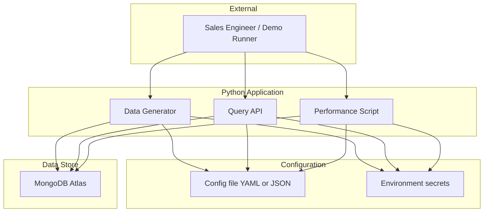
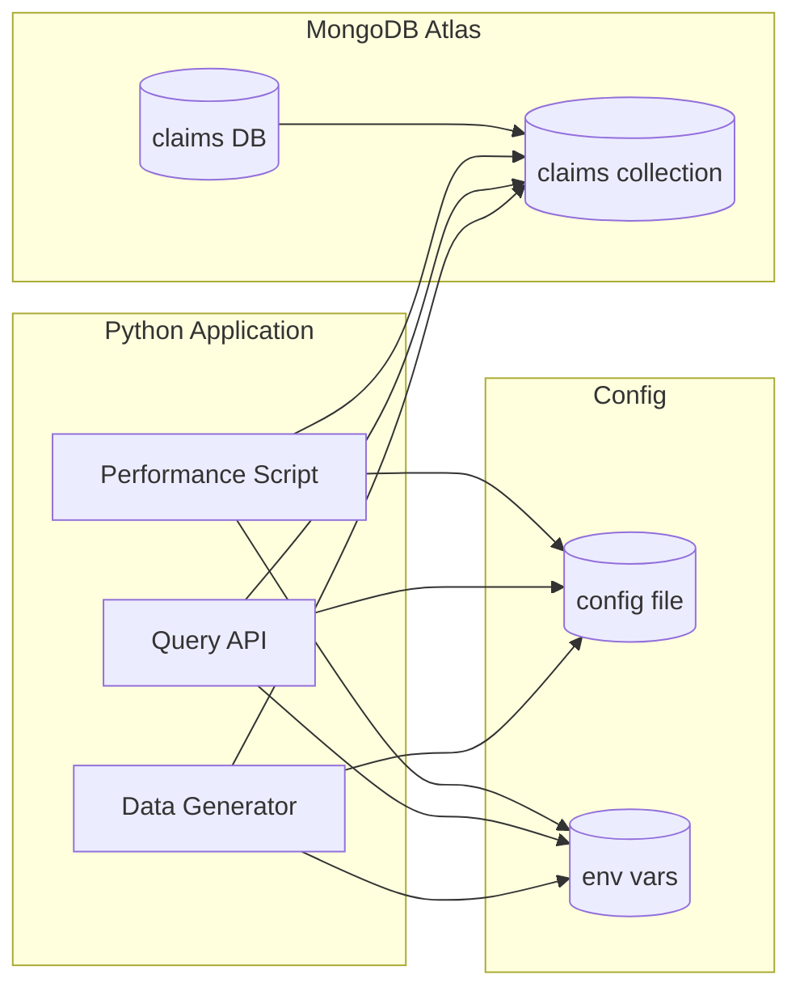
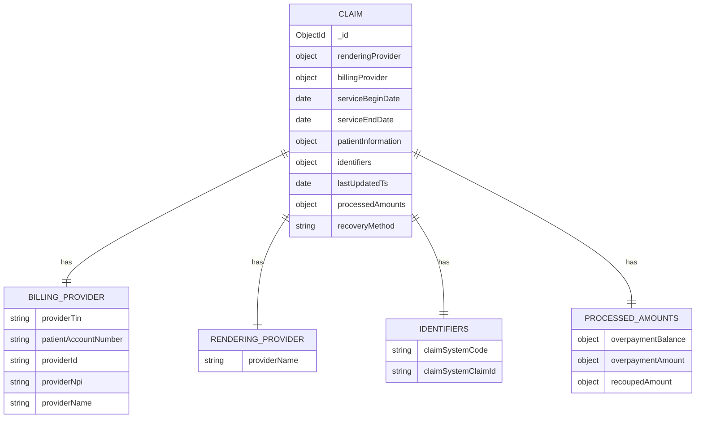
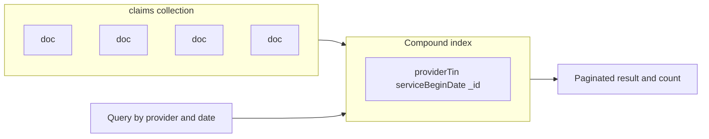
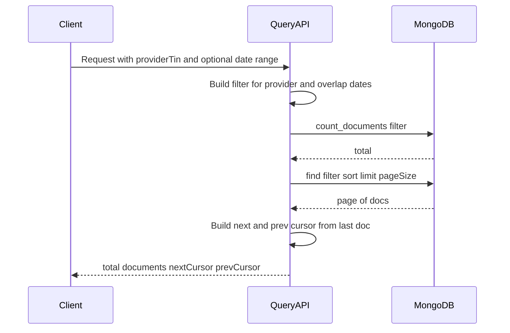
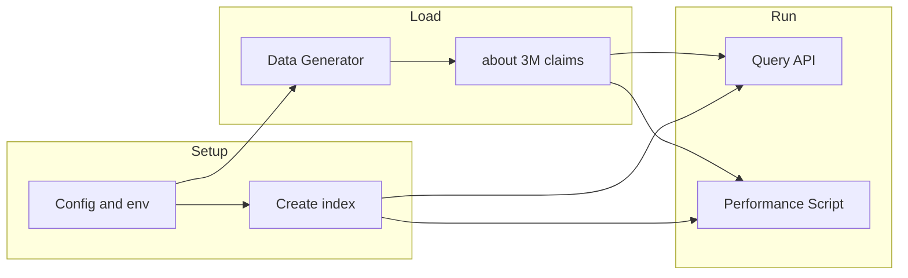
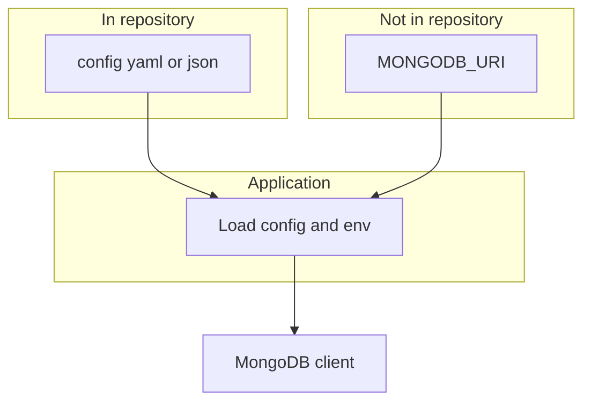

# PBM Integration Services – Architecture

**Version:** 1.0  
**Last Updated:** February 2025  

This document describes the architecture for a customer-facing demonstration of MongoDB’s ability to query and return large volumes of claim documents. It synthesizes the [user requirements](user_requirements.md), [design decisions](DESIGN.md), and [claim schema](sample.json).

---

## 1. Purpose & Goals

| Aspect | Description |
|--------|-------------|
| **Scenario** | Integration between a **healthcare provider** and a **pharmacy benefits manager (PBM)**. Claims are stored as documents; queries are by billing provider (TIN) with an optional service date range. |
| **Objective** | Demonstrate MongoDB’s ability to quickly query and return large volumes of documents, with emphasis on **performance** and **cost** (minimal hardware). |
| **Stack** | Python (application), MongoDB Atlas (operational data store). |
| **Deliverables** | Sample data generator (~3M claims), query API with keyset pagination and total count, performance test script with a report. |

---

## 2. System Context

The system is used by a Sales Engineer (or demo runner) to load data, run queries, and execute performance tests. The Python application is the only system that talks to MongoDB Atlas; configuration and secrets are kept separate.



- **User:** Runs data generation, invokes queries (e.g. by provider TIN ± date range), and runs the performance script.
- **Python Application:** Three logical components—data generator, query API, performance script—share config and one MongoDB Atlas cluster.
- **Configuration:** Non-secrets (database name, collection, page size, tier definitions) in a config file; connection string and credentials in environment variables.

---

## 3. Component Architecture



| Component | Responsibility |
|-----------|-----------------|
| **Data Generator** | Generates ~3M claim documents from the schema in `sample.json`, with tiered provider volumes (1K–1M claims per provider), overlapping dates (all after 2000), and reference value sets. Writes to MongoDB via config (database/collection) and env (URI). |
| **Query API** | Accepts `billingProviderTin` (required) and optional `serviceDateStart` / `serviceDateEnd`. Returns total count (`count_documents`) and paginated results using keyset pagination on `(serviceBeginDate, _id)`. Uses config for page size and collection. |
| **Performance Script** | Runs repeated queries (by provider only; by provider + date range) for one billing TIN per tier. Reports count latency, first-page latency, and optional next-page (keyset) latency (e.g. min/avg/p95). Reads test config (iterations, tiers) and Atlas URI from env. |

---

## 4. Data Architecture

### 4.1 Claim Document (Source of Truth: `sample.json` + DESIGN.md)

One document per claim. Structure inferred from `Docs/sample.json` with types and semantics from the design.



- **Query key:** `billingProvider.providerTin` (billing provider TIN).
- **Date range filter:** `serviceBeginDate` / `serviceEndDate` (overlap semantics: `serviceBeginDate <= end AND serviceEndDate >= start`).
- **Storage:** BSON Date for dates/timestamps; Decimal128 or double for amounts; strings for identifiers.

### 4.2 Collection & Index

- **Collection:** Single collection of claim documents (database and collection names from config).
- **Index (single compound index):**

```text
{ "billingProvider.providerTin": 1, "serviceBeginDate": 1, "_id": 1 }
```

- Supports: equality on provider TIN, range on `serviceBeginDate`, and stable sort for keyset pagination.



---

## 5. Query Flow

Queries are by **billing provider TIN** with an **optional service date range**. The API returns a **total count** and **keyset-paginated** claim documents.



- **Filter:** `billingProvider.providerTin == providerTin`, and if date range is given: `serviceEndDate >= dateStart` and `serviceBeginDate <= dateEnd`.
- **Count:** Separate `count_documents(filter)` (recommended for performance).
- **Sort:** `(serviceBeginDate, _id)` ascending.
- **Keyset (next page):** Add `(serviceBeginDate > last) OR (serviceBeginDate == last AND _id > last_id)` to the filter; previous page uses the opposite bound and reversed sort.

---

## 6. Data Lifecycle



1. **Setup:** Configure database/collection, tier definitions, and page size in config; set `MONGODB_URI` (and any other secrets) in the environment. Create the compound index (e.g. at app startup or via a one-off script).
2. **Load:** Run the data generator to produce ~3M claims with tiered provider volumes and overlapping service dates (all after 2000), then insert into the claims collection.
3. **Run:** Use the query API for ad-hoc or demo queries; run the performance script to measure count and pagination latency and produce the report.

---

## 7. Technology Stack

| Layer | Choice | Notes |
|-------|--------|-------|
| **Language** | Python | Per user requirements. |
| **Data store** | MongoDB Atlas | Operational store; TLS connection from env. |
| **Config** | YAML or JSON | Non-secrets (DB, collection, page size, data-gen tiers, perf iterations). |
| **Secrets** | Environment variables | `MONGODB_URI` (and optional overrides). |
| **Driver** | PyMongo (or Motor if async) | Standard MongoDB driver; compound index and keyset pagination only. |

No Atlas-only query features are required; the design uses a single compound index and standard `find` / `count_documents`.

---

## 8. Configuration & Security



- **In config file:** `mongodb.database`, `mongodb.collection`, `data_generation.*` (tiers, target volume, date window), `query.default_page_size`, `performance.iterations`, `performance.tiers_to_test`.
- **In environment:** `MONGODB_URI` (and optionally `MONGODB_URI_TEST`). No credentials or URIs in the config file or source code.

---

## 9. Key Design Decisions (Summary)

| Decision | Choice | Rationale |
|----------|--------|-----------|
| Query key | `billingProvider.providerTin` | Aligns with “query by provider” and sample schema. |
| Date range | `serviceBeginDate` / `serviceEndDate` (overlap) | Matches “optional date range” and supports flexible reporting. |
| Pagination | Keyset (cursor) on `(serviceBeginDate, _id)` | Stable, efficient; no skip/offset. |
| Total count | Separate `count_documents()` | Predictable performance at scale vs. $facet. |
| Index | Single compound: `(providerTin, serviceBeginDate, _id)` | Supports filter, sort, and keyset in one index. |
| Data volume | ~3M claims; ≥1 provider per tier 1K–1M; more providers at lower tiers | Supports performance testing across tiers. |
| Service dates | All after year 2000 | Realistic and consistent date window. |
| Config vs secrets | Config file vs. env | Keeps credentials out of repo and config. |

---

## 10. Related Documents

- [User requirements](user_requirements.md) – Context, requirements, and constraints.
- [Design document](DESIGN.md) – Schema, indexes, query design, data generation, performance testing, and configuration in detail.
- [Claim schema (sample)](sample.json) – Canonical claim document structure used for generation and validation.
